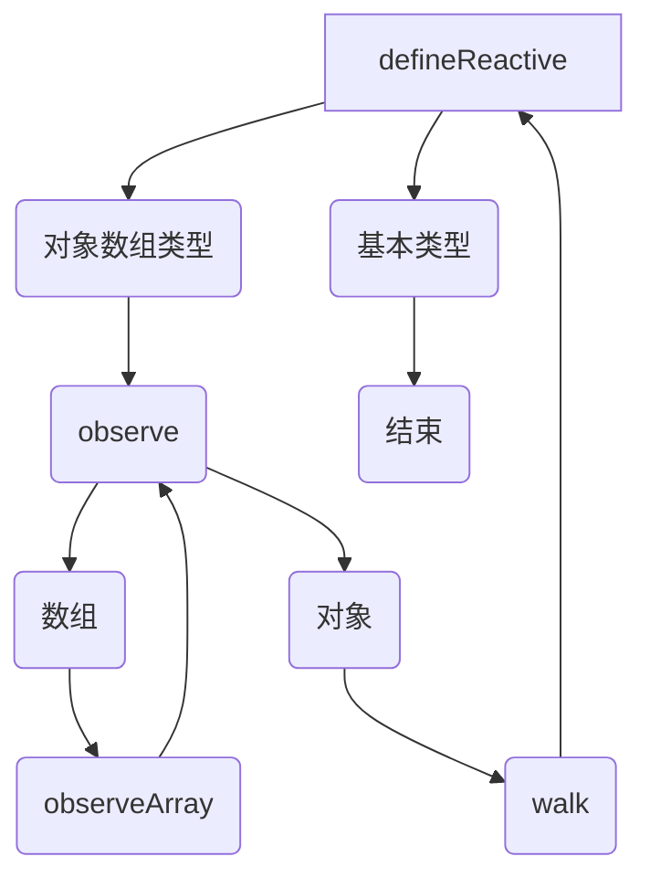

> vue 的响应式原理分析，如果对于细节部分剖析的不够清晰丢失细节，就会在阅读代码的时候一知半解。本章将从构成响应式的每个部分开始全面分析其原理。承接上一章节，initState 的核心就是就是注册响应式。
> 本章将会涉及到以下响应式相关的概念。

> ⚠️：为了能读懂本章节内容，首先明确一个概念。对于 props，data，computed 中的属性都是响应式的，vue 内部赋予这些属性一种魔力，哪里用到这些属性，这个属性就会拿个记录本“记住”当前所在的环境，在这个属性变化的时候就翻开记录本去依次通知记录的每个环境，然后环境去告知环境中所有的内容去检查更新。其中记录本就是“Dep”，而环境就是“Watcher”。摘取的源码省略了部分 SSR 的相关逻辑。

1. Dep
2. Wathcer
   - render-wathcer
   - computed-wathcer
   - user-wathcer
3. Obeserver
4. defineReactive
5. observe
6. initState

#### Dep

##### Dep 构造器

依赖收集器，收集订阅者。每个响应式的属性都包含一个 dep（记录本），用于收集使用了当前属性的订阅者，订阅者本质上就是 wathcer。

```javascript
var uid = 0;
var Dep = function Dep() {
  this.id = uid++;
  this.subs = [];
};
```

- id 每个 dep 都有一个唯一的 id，唯一标识当前 dep。
- subs 订阅者，wathcer 数组。

##### Dep 实例方法

```javascript
Dep.prototype.addSub = function addSub(sub) {
  this.subs.push(sub);
};

Dep.prototype.removeSub = function removeSub(sub) {
  remove(this.subs, sub);
};
```

- addSub 添加订阅者。
- removeSub 当某个调用当前属性的地方不在调用了，就从订阅者列表中清除这个订阅者。

```javascript
Dep.prototype.depend = function depend() {
  if (Dep.target) {
    Dep.target.addDep(this);
  }
};

Dep.prototype.notify = function notify() {
  var subs = this.subs.slice();
  for (var i = 0, l = subs.length; i < l; i++) {
    subs[i].update();
  }
};
```

- depend 收集订阅者，本质上就是调用 addSub，只不过在调用之前检查当前的依赖是不是已经收集过了，跳过已经收集过的依赖。
- notify 更新订阅者，通知订阅者数据已经发生变化了，需要每个订阅者去触发自己的回调（可能是更新视图也可能是触发用户设置的回调）。

##### Dep 静态属性和全局方法

```javascript
Dep.target = null;
var targetStack = [];

function pushTarget(target) {
  targetStack.push(target);
  Dep.target = target;
}

function popTarget() {
  targetStack.pop();
  Dep.target = targetStack[targetStack.length - 1];
}
```

- Dep.target 当前正在执行更新(或者初始化)的 wathcer。
- targetStack 维护一个 wathcer 的栈结构，因为在更新一个 watcher 的时候也可能会进入其他的 watcher 的内部，此时就需要保存上一个 watcher，为了回溯的时候不丢失上个 watcher。
- push/popTarget 操作这个栈结构，push 压栈，pop 弹栈，Dep.target 始终指向栈顶元素。

#### Watcher

##### render-wathcer

当执行创建组件的方法，就会为每个组件 vm 创建一个 wathcer，查看 vue 通过如下代码进行 render-watcher 的创建。

```javascript
new Watcher(
  vm, // watcher.vm
  function() {
    // watcher.getter
    vm._update(vm._render(), false);
  },
  noop, // watcher.cb
  {
    // watcher.before
    before: function before() {
      if (vm._isMounted && !vm._isDestroyed) {
        callHook(vm, "beforeUpdate");
      }
    },
  },
  true /* isRenderWatcher */
);
```

需要注意的是 render-wathcer 是把当前 vm 的\_render 和\_update 方法传入然后等待执行，对于 render-watcher 来说，更新视图就是它的 getter 的任务，分解来说就是：

- 在挂载组件的时候会初始化当前 vm 对应的 render-watcher
- getter 会在 watcher 初始化的时候执行，就会执行 render 生成 vnode 并 update 生成真实 dom，
- 因为渲染过程中必然会用到 prop，computed，data 中的属性，这样就在渲染的同时进行依赖收集。

##### computed-wathcer

用户传入的 computed 计算属性本质上也是 watcher，和 watch 属性不同的是，计算属性的 watch 是 lazy 的。如下：

```javascript
new Watcher(
  vm, // watcher.vm 当前计算属性所在的vm
  getter || noop, // watcher.getter 用户传入的方法
  noop, // watcher.cb
  { lazy: true } // watcher.lazy
);
```

和 render-watcher 相同，计算属性的 getter 内部使用的响应式属性的 dep 也会记录当前 computed-wathcer，用传入的方法其实就是 getter。如下：

```javascript
computed:{
    property(){
        return this.firstName + this.lastName
    }
}
```

此时 firstName 的 dep 和 lastName 的 dep 都将记录当前计算属性的 watcher，另外还会记录当前计算属性所在的其他 watcher，比如计算属性在 template 模版中使用了，在渲染的时候，就会记录下 vm 的 render-watcher，如果当前计算属性在其他计算属性使用了，就会记录其他计算属性的 watcher，相当于是把这些 watcher 的嵌套关系进行一层深度的拍平然后添加到每个 dep 中去。

##### user-watcher

用户通过 watch 传入或者通过 this.\$watch()生成的 watcher，vue 内部通过如下方式创建一个 user-watcher。

```javascript
var watcher = new Watcher(
  vm, // watcher.vm
  expOrFn, // watcher.getter
  cb, // watcher.cb
  Object.assign({ user: true }, userOptions) // watcher.user 以及其他用户想要配置的内容
);
```

可以发现 user-watcher 主要配置了 user:true 属性，然后用户可以传入一些配置去控制这个 watcher。

```javascript
this.$watch(
  "a",
  function() {
    //do something 当 vm['a'] 的值变化
  },
  { deep: true }
);
```

这个例子中'a'将会转化为 user-watcher 的 getter。实际上就是对 vm['a']进行一次函数封装,当然这是个响应式的值，在初始化这个 watcher 的时候就会用到 getter，进而出发到 vm['a']，这个响应式的值的 dep 就会收集到当前 user-watcher，也就可以在 vm['a']变化的时候去通知到 user-watcher 也能去调用用户传入的回调。

##### Watcher 构造器

```javascript
var uid$2 = 0;
var Watcher = function Watcher(vm,expOrFn,cb,options, isRenderWatcher) {
  this.vm = vm;
  if (isRenderWatcher) {
    vm._watcher = this;
  }
  vm._watchers.push(this)
  this.id = ++uid$2;
```

- 入参
  - vm 当前 watcher 对应的组件实例
  - expOrFn 每次响应式数据变化都将触发的方法或者表达式指向的方法
  - cb 用户传入的回调方法，当 expOrFn 执行完毕之后和上次保存的值做比对，如果变化了就会触发回调。
  - options ⚠️ 这个 options 不是组件的 options，而是当前 watcher 的 optons
  - isRenderWatcher 标识当前是不是组件的渲染 watcher
- id 每一个 watcher 都有唯一的 id，这个 id 在渲染的时候会被用于排序（这点在 nextTick 章节进行详细解读）。
- vm.\_watcher 如果传入了标识，就把当前 watcher 作为当前 vm 的渲染 watcher 进行赋值。
- vm.\_watchers 无论是渲染 watcher 还是其他 watcher，都会保存到当前 vm 的 \_watchers 数组中。

```javascript
if (options) {
  this.deep = !!options.deep;
  this.user = !!options.user;
  this.lazy = !!options.lazy;
  this.sync = !!options.sync;
  this.before = options.before;
} else {
  this.deep = this.user = this.lazy = this.sync = false;
}
this.cb = cb;
this.active = true;
this.dirty = this.lazy;
this.deps = [];
this.newDeps = [];
this.depIds = new _Set();
this.newDepIds = new _Set();
this.expression =
  process.env.NODE_ENV !== "production" ? expOrFn.toString() : "";
```

- deep 当前是不是深度监听的，用户手动设置后为 true
- user 标识用户设置的 watcher
- lazy 标志当前 watcher 是不是 lazy 的（用到的时候才计算值）。
- sync 近开发模式下可设置，设置 true 后 watcher 的更新将在本次时间循环而不去添加到 nextTick 执行。
- before 在执行 watcher 更新之前需要执行的方法（在 render-watcher 的 case 下，执行的是 beforeUpdate 钩子）
- cb 在执行 watcher 更新之后需要执行的回调，会传入新值和旧值，用于用户自定义的 watcher。
- active 标识当前 watcher 是不是活跃的。在 watcher 被关闭后为 false
- dirty 标识当前 watcher 的值有没有变化，作为 lazy 化的 watcher 的计算标识。
- deps 被当前 watcher 订阅的 dep（也就是保存了当前 watcher 都位于哪些 dep.subs 数组中）
- newDeps wathcer 每次进行订阅的 dep 都将保存到这个数组中，这个数组将会和 deps 进行比较（其实就是更新 dep 的订阅者数组，防止在用户进行依赖解除（可能是 teardown）之后还触发无用的更新）
- depIds 保存 deps 中每个 dep 的 id
- newDepIds 保存 newDeps 中每个 dep 的 id
- expression 在开发环境下保存用户传入的需要监听表达式，没有什么实际用处。只是在调试的时候看一看。

```javascript
  if (typeof expOrFn === 'function') {
    this.getter = expOrFn;
  } else {
    this.getter = parsePath(expOrFn);
    if (!this.getter) {
      this.getter = noop;
    }
  }
  this.value = this.lazy ? undefined : this.get();
};
```

- getter 根据用户传入的表达式或者是 function 计算出需要监听的数据。如下:

```javascript
// 1
this.$watch(
  "a.b.c",
  function() {
    //do something 当 vm['a']['b']['c'] 的值变化之后
  },
  { deep: true }
);

// 2
this.$watch(
  function() {
    return this["a"] + this["b"];
  },
  function() {
    // do something 当vm['a'] + vm['b']的和变化之后
  }
);
```

- value 是 getter 执行之后的返回值

##### Watcher 的实例方法

```javascript
Watcher.prototype.get = function get() {
  pushTarget(this);
  var value;
  var vm = this.vm;
  try {
    value = this.getter.call(vm, vm);
  } catch (e) {
    if (this.user) {
      handleError(e, vm, 'getter for watcher "' + this.expression + '"');
    } else {
      throw e;
    }
  } finally {
    if (this.deep) {
      traverse(value);
    }
    popTarget();
    this.cleanupDeps();
  }
  return value;
};
```

new Wacther()最终会触发这个 get 方法(除了 lazy 模式)

- 设置当前依赖目标 Dep.target 为当前 watcher， 可能是 user-watcher computed-watcher render-wathcer 三者任意一个，设置完之后在执行 getter，就会在依赖收集的时候收集到 Dep.target 了。
- 然后去执行当前 wactcher 对应的 getter 并返回计算值
- traverse 进行深度的依赖收集
- cleanupDeps 更新 dep 和 depid 数组

```javascript
Watcher.prototype.addDep = function addDep(dep) {
  var id = dep.id;
  if (!this.newDepIds.has(id)) {
    this.newDepIds.add(id);
    this.newDeps.push(dep);
    if (!this.depIds.has(id)) {
      dep.addSub(this);
    }
  }
};
```

addDep 非常简单，就是把当前 wathcer 添加到 dep 中去，在 Dep.prototype.depend 进行调用。

```javascript
Watcher.prototype.cleanupDeps = function cleanupDeps() {
  var i = this.deps.length;
  while (i--) {
    var dep = this.deps[i];
    if (!this.newDepIds.has(dep.id)) {
      // 新传入的依赖项中没有当前id 就在dep中删除当前wathcer  就代表更新后的dep中不需要收集当前watcher
      dep.removeSub(this);
    }
  }
  var tmp = this.depIds;
  this.depIds = this.newDepIds;
  this.newDepIds = tmp;
  this.newDepIds.clear(); // 新旧depid依赖交换 然后把新的清空 等待下次依赖更新

  tmp = this.deps;
  this.deps = this.newDeps;
  this.newDeps = tmp;
  this.newDeps.length = 0; // 新旧dep交换
};
```

cleanupDeps 去保证当前只收集了实际应用到的 dep，防止触发无用的 watcher.update 而造成性能浪费。

```javascript
Watcher.prototype.update = function update() {
  if (this.lazy) {
    this.dirty = true;
  } else if (this.sync) {
    this.run();
  } else {
    queueWatcher(this);
  }
};
```

update 方法只是一个简单的触发器，分别为 lazy 的 wathcer 标记 dirty，在同步模式下直接进行 run 方法进行视图更新或者数据更新，在异步模式下通过 nextTick 在下个事件循环去触发 run 方法，实际上 update 方法就是对 run 方法的二次封装。

```javascript
Watcher.prototype.run = function run() {
  if (this.active) {
    var value = this.get();
    if (value !== this.value || isObject(value) || this.deep) {
      var oldValue = this.value;
      this.value = value;
      if (this.user) {
        try {
          this.cb.call(this.vm, value, oldValue);
        } catch (e) {
          handleError(
            e,
            this.vm,
            'callback for watcher "' + this.expression + '"'
          );
        }
      } else {
        this.cb.call(this.vm, value, oldValue);
      }
    }
  }
};
```

run 方法做了两件事：

- 通过 get 方法去触发 wathcer.getter,重新计算值或者视图更新。
- 通过 cb 传入更新前的值和更新后的值供用户传入的方法使用。

```javascript
Watcher.prototype.evaluate = function evaluate() {
  this.value = this.get();
  this.dirty = false;
};
```

evaluate 是为 lazy 的 watcher 服务的（大多是为了 computed 服务的），在用到的 lazy 的 wathcer 值的时候就通过这个方法临时计算一下值。

```javascript
Watcher.prototype.depend = function depend() {
  var i = this.deps.length;
  while (i--) {
    this.deps[i].depend();
  }
};
```

depend 是遍历当前 watcher 内部所有的 dep 对当前 Dep.target 全部进行一次依赖收集，主要也是为了 computed 服务的。

```javascript
Watcher.prototype.teardown = function teardown() {
  if (this.active) {
    if (!this.vm._isBeingDestroyed) {
      remove(this.vm._watchers, this);
    }
    var i = this.deps.length;
    while (i--) {
      this.deps[i].removeSub(this);
    }
    this.active = false;
  }
};
```

teardown 关闭当前 watcher，在所有 dep 中清楚该 watcher（解除订阅），active 标识为 false，防止再次触发 update。

#### Observer

Observer 其实非常简单，功能只有一个，就是为对象或者数组类型的值注册响应式。observe 方法内部也是在调用 new Observer()并返回这个实例，而 defineReactive 内部也会为对象类型的属性进行 observe(value)调用，实际上也是为对象属性创建 Obsever。无论是对象还是数组，整个响应式注册过程是深度遍历的过程。

##### Observer 构造器

```javascript
var Observer = function Observer(value) {
  this.value = value;
  this.dep = new Dep();
  this.vmCount = 0;
```

- dep 对象类型的值拥有两个 dep，一个 dep 是在 defineReactive 内部闭包定义保存的 dep，这个 dep 可以在直接删除当前对象或者修改当前对象的时候达到响应式。但是对于没有在 data 中进行初始化的对象的属性，就无法达到响应式操作，于是就为对象和数组类型能够在添加值的时候达到响应式而再次创建一个 dep，（这个 dep 是在$set，$delete 方法被执行时进行 notify 操作，这里仅需明白是为了对象响应式做服务即可）。
- value 需要注册响应式的值
- vmCount 记录当前 observer 实例相关的 vm 数量

```javascript
  def(value, '__ob__', this);
  if (Array.isArray(value)) {
    if (hasProto) {
      protoAugment(value, arrayMethods);
    } else {
      copyAugment(value, arrayMethods, arrayKeys);
    }
    this.observeArray(value);
  } else {
    this.walk(value);
  }
};
```

`__ob__` 就是为当前对象 value 添加 oberver 实例，通过类型判断分别为对象和数据进行不同的响应式处理。

##### Observer 的实例方法

```javascript
Observer.prototype.walk = function walk(obj) {
  var keys = Object.keys(obj);
  for (var i = 0; i < keys.length; i++) {
    defineReactive$$1(obj, keys[i]);
  }
};
```

- walk 方法是为对象类型的属性注册响应式，遍历对象上的每个属性，调用 defineReactive 去分别为每个属性进行注册，完成递归的响应式注册。

```javascript
Observer.prototype.observeArray = function observeArray(items) {
  for (var i = 0, l = items.length; i < l; i++) {
    observe(items[i]);
  }
};
```

- observeArray 遍历数组中的每个数据进行响应式注册，需要作出区别的是，直接调用 observe 仅仅对对象类型的属性进行深层的响应式注册，而无需对基本类型进行 defineReactive，因为数据在原型链上添加了一层拦截，用于处理基础类型的响应式处理。

#### defineReactive - 定义响应式

vue 响应式中最核心的部分。这个方法就是赋予每个属性响应式的附魔师。

```javascript
function defineReactive(obj,key,val,customSetter,shallow) {
  var dep = new Dep();
```

- 入参
  - obj 需要定义响应式的对象
  - key 需要定义响应式的对象的属性名
  - val 需要定义响应式的对象的属性名对应的初值
  - customSetter 个性化 setter，主要为了在用户试图外部修改某些值的时候进行提示，例如 prop 属性，inject 属性，是不推荐外部修改的。
  - shallow 是不是注册浅层的响应式。例如$listeners，$attrs 都是注册了浅层的响应式。因为在更新组件的时候是直接替换$attrs和$listeners，无需注册深层的响应式。
- dep 初始化一个 dep，去收集该属性所有的订阅者，每个属性都通过闭包持有一个 dep。

```javascript
var property = Object.getOwnPropertyDescriptor(obj, key);
if (property && property.configurable === false) {
  return;
}
var getter = property && property.get;
var setter = property && property.set;
var childOb = !shallow && observe(val);
```

- property 当前 key 对应的属性描述对象，这个对象包含了 obj[key]的可枚举性，可配置性，以及 getter，setter，通过该对象查看当前属性是不是可配置的，如果 false 直接 return
- getter 调用 getter 可以获取这个 obj[key]的值
- setter 调用 setter(newVal)可以设置 obj[key]为 newVal
- childOb 可以发现 defineReactive 调用了 observe(val)进行深层的响应式注册。 而 observe 只会对对象类型的属性进行响应式注册（下面有 observe 方法的分析），在上边 Obsever 构造器的分析中，`def(value, '__ob__', this);`，可以得知内部为每个对象属性添加一个`__ob__`，这里拿到的 childOb 就是为当前属性创建的 Obsever 实例。

```javascript
  Object.defineProperty(obj, key, {
    enumerable: true,
    configurable: true,
    get: function reactiveGetter() {
      var value = getter ? getter.call(obj) : val;
      if (Dep.target) {
        dep.depend();
        if (childOb) {
          childOb.dep.depend();
          if (Array.isArray(value)) {
            dependArray(value);
          }
        }
      }
      return value
    },
```

- get 特性，取值的时候会触发。需要注意的是 value 是取到的函数内的闭包变量 val，相应的在 set 内部赋值的时候也是设置这个闭包变量，如果没有这个变量，直接 obj.val 的方式取值的化，就会不断循环（在 get 内部再次吊起 get）导致 stackoverflow。取完值之后检查 Dep.target，也就是当前变量使用的环境，假设在渲染的过程中，这个 target 就是 render-watcher，如果在计算属性被使用的过程中，这个 target 则为 computed-watcher。确定环境 watcher 之后就可以进行依赖收集。此时当前 value 值会访问到闭包变量 dep，通过 dep.depend()去吧 target 添加到 dep.subs 也就是订阅者列表。如果当前的值是对象类型的，就会通过 observe()去获取对象的`__ob__.dep`，让这个对象类型的属性也收集到当前 target，也就是进行深层的依赖收集，为的是在给对象或者数组添加额外属性或者删除属性的时候可以进行响应式操作（为 vm.$set vm.$delete 做 hack）。

```javascript
    set: function reactiveSetter(newVal) {
      var value = getter ? getter.call(obj) : val;
      if (newVal === value || (newVal !== newVal && value !== value)) { // 看看值变了没有 如果没变也无需后续流程
        return
      }
      if (process.env.NODE_ENV !== 'production' && customSetter) {
        customSetter(); // 代码提示
      }
      if (getter && !setter) { // 没有setter直接return
        return
      }
      if (setter) {
        setter.call(obj, newVal);  // 真正的赋值
      } else {
        val = newVal;
      }
      childOb = !shallow && observe(newVal); // 处理传入的对象类型的值
      dep.notify(); // 响应式更新
    }
  });
}
```

- set 特性 在 get 特性中进行了依赖收集之后，就可以在 set 被触发的时候对订阅者进行通知，完成视图更新或者去调用用户传入的回调。首先访问闭包变量去对比新传入的值有没有变化，如果没变直接 return。把新值赋值给原属性，这里要注意，需要用 observe 对新传入的值进行响应式处理，为的是如过传入了对象类型的值，不为其注册响应式就会导致该对象属性更新之后不会让视图更新。在注册完毕之后，就会通过 dep.notify 去通知所有订阅者进行视图更新或者触发回调。

#### observe - 为对象类型的属性定义响应式

```javascript
function observe(value, asRootData) {
  // 如果传入的需要观察的值不是一个对象或者是数组 或者是一个Vnode类型的对象 都会直接return
  if (!isObject(value) || value instanceof VNode) {
    return;
  }
  var ob;
  // 首先检查当前对象包不包含自己的__ob__ 如果有直接返回当前对象的__ob__
  if (hasOwn(value, "__ob__") && value.__ob__ instanceof Observer) {
    ob = value.__ob__;
  } else if (
    shouldObserve && // 当前状态是不是可观察的 （）
    !isServerRendering() && // 是不是服务器端渲染的
    (Array.isArray(value) || isPlainObject(value)) && // 检测当前value值必须是严格对象或者是数组才会为其注册外层ob，然后添加dep。
    Object.isExtensible(value) && // 查看当前对象是不是可扩展的
    !value._isVue // 最后检测当前值不是vue实例 避免去观察vm
  ) {
    // 直接new ob 最后返回ob
    ob = new Observer(value);
  }
  if (asRootData && ob) {
    // 如果当前是作为rootdata传进来 也就是说当前传入vm._data
    ob.vmCount++;
  }
  return ob;
}
```

observe 首先剔除非对象值和 vnode。然后检查当前对象是否已经是响应式的了，如果已经是就直接拿到对象的`__ob__`返回，如果不是响应式的就通过 new Obsever 去注册响应式并返回这个对象。

至此，对 defineReactive 的过程进行一个简单的流程梳理。



#### initState 初始化数据

```javascript
function initState(vm) {
  vm._watchers = [];
  var opts = vm.$options;
  if (opts.props) {
    initProps(vm, opts.props); // 初始化props
  }
  if (opts.methods) {
    initMethods(vm, opts.methods); // 初始化method
  }
  if (opts.data) {
    // 为data递归添加了__ob__ 在创建__ob__的过程中会defineRective方法进行响应式注册
    initData(vm);
  } else {
    observe((vm._data = {}), true /* asRootData */); // 传入vm._data asRootData = true
  }
  if (opts.computed) {
    // 初始化computed
    initComputed(vm, opts.computed);
  }
  if (opts.watch && opts.watch !== nativeWatch) {
    initWatch(vm, opts.watch); // 初始化watch
  }
}
```

可以发现 initState 内部结构非常清晰，共分为以下几部分。

- 初始化 props
- 初始化 method
- 初始化 data
- 初始化 computed
- 初始化 watch
  接下来看看这些初始化都做了什么。

##### initProps

```javascript
function initProps(vm, propsOptions) {
  var propsData = vm.$options.propsData || {}; // 组件占位节点传入的props
  var props = (vm._props = {}); // 组件options上的_props (将会被vm自身代理)
  // 缓存propskeys到数组中去 就可以使用数组的遍历 而不用使用对象的动态枚举
  var keys = (vm.$options._propKeys = []);
  var isRoot = !vm.$parent;
  // root instance props should be converted
  // 如果不是根组件的话就不去为当前props中的对象类型的变量创建 Observer
  if (!isRoot) {
    toggleObserving(false);
  }
  var loop = function(key) {
    keys.push(key);
    // 对每个props值进行类型匹配和转换
    var value = validateProp(key, propsOptions, propsData, vm);
    defineReactive$$1(props, key, value);
    if (!(key in vm)) {
      proxy(vm, "_props", key);
    }
  };

  for (var key in propsOptions) loop(key);
  toggleObserving(true);
}
```

initprops 内部也很简单，新建一个对象，然后通过遍历组件传入的 props 进行注册响应式，其中有几个参数。

- propsOptions 组件内部定义的可以接受的 props（export default 到处的对象的 props）
- propsData 组件占位节点传入的 props，也就是真正用到的 props
- \_props propsData 通过 defineReactive 响应式处理后的 props
- \_propKeys propsData 中的每个属性名组成的数组
  还有几个细节值得注意：
- validateProp 在设置 prop 的时候可以传入 type 属性，这个方法就是把站位节点上的数据转换成对应的类型。
- toggleObserving 因为 props 是从父组件上传递过来的，对于对象类型值其实是父组件内定义的，也就已经注册了响应式，所以无需再次为对象类型注册深层响应式，在使用属性的时候就会记录子组件内相关的 watcher（依赖收集），这样在父组件中修改数据，子组件也会发生变化。
- proxy 为了用户方便使用，可以通过 this['属性名']的方式调用 props 属性，通过 proxy 去代理到 vm 本身。

##### initMethods

method 相对于 props 更为简单，仅仅做了 this 的绑定，如下：

```javascript
function initMethods(vm, methods) {
  var props = vm.$options.props;
  for (var key in methods) {
    vm[key] =
      typeof methods[key] !== "function" ? noop : bind(methods[key], vm);
  }
}
```

- 这里的 bind 非常精妙，始终将当前 method 绑定在当前组件的作用域中（当前组件实例），也就是说当前组件的 method 中的 this 始终指向父组件 vm 本身，这么做也就为了函数和属性定义在哪里，运行作用域就在哪里。
- 在父子组件通信的过程中，当组件在初始化的时候从占位节点上拿到的方法会在创建组件实例的时候，传递到子组件的事件中心中（第三章有分析过：组件占位节点上定义的方法会传给组件渲染节点的事件中心中去`_events[eventName]`）。去当子组件\$emit 一个方法的时候就会触发到事件中心的对应方法或者方法数组，从原理上讲子组件实际上为自己派发了一个事件，而不是为父组件派发了一个事件。
  于是 ：这个方法定义在父组件，运行在父组件，却保存在子组件。给用户一种父子组建通信的错觉。

##### initData

为组件内部的数据进行响应式注册。

```javascript
function initData(vm) {
  var data = vm.$options.data;
  // 首先判断data是不是function 如果是 执行函数  如果不是 直接返回data
  // (如果是非function类型的额将会导致所有的使用该组件的地方相互影响 - 引用传递)
  data = vm._data = typeof data === "function" ? getData(data, vm) : data || {};
  var keys = Object.keys(data);
  var i = keys.length;
  while (i--) {
    if (!isReserved(key)) {
      proxy(vm, "_data", key);
    }
  }
  observe(data, true /* asRootData */);
}
```

通过 observe 对 data 注册深层的响应式。

#### initComputed

计算属性本质上就是 watcher，只不过计算属性是 lazy 的，只有被用到的时候才会重新计算值。

```javascript
function initComputed(vm, computed) {
  // 首先为当前vm创建一个哈希表保存计算属性的watcher
  var watchers = vm._computedWatchers = Object.create(null);

  for (var key in computed) { // 遍历
    var userDef = computed[key];
    var getter = typeof userDef === 'function' ? userDef : userDef.get;

    watchers[key] = new Watcher(
      vm,
      getter || noop,
      noop,
      computedWatcherOptions
    );

    if (!(key in vm)) {
        Object.defineProperty(vm, key, {
            get:function computedGetter() {
                // 首先拿到哈希表中对应的watcher
              var watcher = this._computedWatchers && this._computedWatchers[key];
              if (watcher) {
                if (watcher.dirty) { // 判断计算结果值变了没有
                  watcher.evaluate(); // 变了就进行一次evaluate 初始化的时候也要执行一次计算
                }
                if (Dep.target) {
                  watcher.depend(); // 对所有当前计算属性所有依赖项进行当前target下的依赖收集
                }
                return watcher.value // 返回最新的计算属性值
              }
            }Ï
        });
    }
  }
}
```

可以看到重新定义了计算属性的值，在获取计算属性的时候同样 Object.defineProperty 去添加一个 get 特性。可以发现计算属性有两个特点

- 计算属性只有在真正调用到的时候才会通过计算属性的 watcher.evaluate 去计算值。
- 在执行完 watcher.evaluate 之后，Dep.target 指向的当前计算属性的环境 watcher 之中，可能是其他计算属性，user-watcher，或者是 render-wathcer，通过 watcher.depend 循环 watcher.deps 中的每一个 dep 去进行依赖收集,这样做的目的是把当前**计算属性中用到的**响应式属性和当前计算属性的环境 watcher 建立关系,这样 computed 内部属性变化的时候就会通知到 computed 所在的 watcher 环境去响应式变化，这时候就会再次进入到这个方法，调用 watcher.evaluate 获取计算属性的结果然后返回。也就达到了计算属性中的用到的值变了就会去触发计算属性重新计算，首先触发 computed 属性的 watcher 把当前状态设置为 dirty，这样一来再触发环境 watcher 的 update 方法的时候就可以顺利触发 evaluate 重新计算值。（这个触发顺序是严格保证的，在 queueWatcher 的内部完成排序，后续会仔细分析）。

#### initWatch

初始化用户定义的 watch，没有什么额外注意的地方,遍历去添加 user-wathcer。

```javascript
function initWatch(vm, watch) {
  for (var key in watch) {
    var handler = watch[key];
    var options = {};
    options.user = true;
    if (Array.isArray(handler)) {
      for (var i = 0; i < handler.length; i++) {
        new Watcher(vm, key, handler, options);
      }
    } else {
      new Watcher(vm, key, handler, options);
    }
  }
}
```

#### 结

本章内容非常繁杂，难理解的部分较多，后续章节将会分析从挂载到渲染的过程，在这个过程中会不断的渗透响应式原理，响应式系统也是 vue 中很重要的一部分，需要不断的深入学习及使用才能体会奥妙。

《完》
